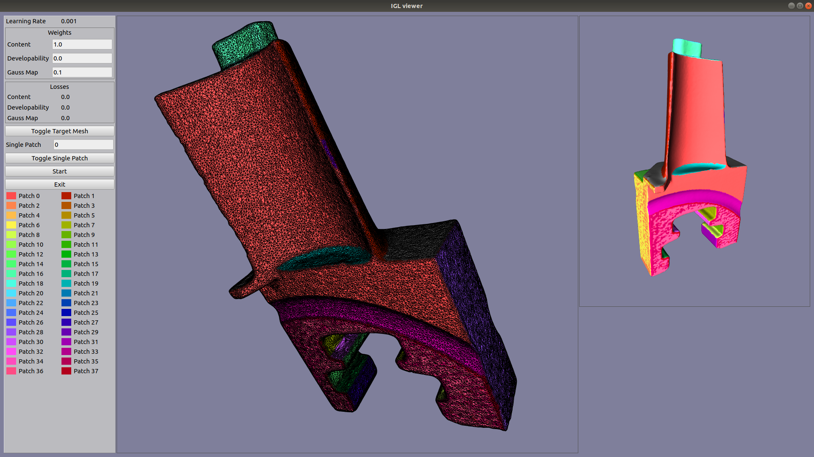

# PyIGL Viewer for scientific 3D mesh visualization

An OpenGL renderer written from scratch in Python using PyQt5 and PyOpenGL.
Its purpose is to simplify mesh visualization for Python graphics research projects.



## Getting Started

### Prerequisites

These modules should be installed by PyPi when installing the viewer:
1. PyQt5
2. PyOpenGL

### Installation

To use this module, you have two options:

1. Clone this repository and run `pip install -e .` from the root of the repository.
2. Install with pip directly: `pip install git+git://github.com/sunreef/PyIGL_viewer.git`

### Usage

In this simple example, we use [LibIGL Python bindings](https://github.com/libigl/libigl-python-bindings) to load an OBJ file and display it with our default shader.

```python
import numpy as np
import igl
from PyQt5.QtWidgets import QApplication
from PyIGL_viewer import Viewer

# Path to your OBJ file stored in path_to_obj_file 
vertices, faces = igl.read_triangle_mesh(path_to_obj_file)

# Create Qt application and our viewer window
viewer_app = QApplication(["IGL viewer"])
viewer = Viewer()
viewer.show()
viewer.set_column_stretch(0, 1)

# Add a viewer widget to visualize 3D meshes to our viewer window
viewer_widget, _ = viewer.add_viewer_widget(0, 0)
viewer_widget.show()

# Add a screenshot button
def screenshot_function():
    viewer.save_screenshot(os.path.join('screenshot.png'))
viewer.add_ui_button("Take Screenshot", screenshot_function)

# Add a mesh to our viewer widget
# This requires three steps:
# - Adding the mesh vertices and faces
# - Adding a mesh prefab that contains shader attributes and uniform values
# - Adding an instance of our prefab whose position is defined by a model matrix
mesh_index = viewer_widget.add_mesh(vertices, faces)
mesh_prefab_index = viewer_widget.add_mesh_prefab(mesh_index, 'default')
instance_index = viewer_widget.add_mesh_instance(mesh_prefab_index, np.eye(4, dtype='f'))


# Add the wireframe for our mesh 
viewer_widget.add_wireframe(instance_index, line_color=np.array([0.1, 0.1, 0.1]))

# Launch the Qt application
viewer_app.exec()
```

The image created when clicking the `Take Screenshot` button should be similar to the following image from the `basic_display.py` example:


## Examples

Python scripts showing how to use the viewer can be found in the `examples` folder in this repository.
To run an example, make sure you have the viewer installed in your current Python environment and run the script using `python examples/*script_name*`.

## License

This project is licensed under the GNU General Public License - see the [LICENSE.md](LICENSE.md) file for details

